# Unicode browser

There is simple application, wchich has following abilities and purposes:


* Browse Unicode characters by code\.
* Find codes of characters used in text\.
* Find character by name\.
* Convert supplied text into text written using ASCII characters only\.s
* Preview characters connected with other characters\.
* Collect unicode characters as text to copy\.
* Test system fonts and downloadable fonts\.
* Write text using specified font\.

This application should work on every HTML5\-complaint browser and can be run by opening the **unicode\.htm** file\.

The application is available online from the address: [https://andrzejlisek\.github\.io/Unicode/unicode\.htm](https://andrzejlisek.github.io/Unicode/unicode.htm "https://andrzejlisek.github.io/Unicode/unicode.htm")

# Character data

Application uses data generated from the four Unicode official files:


* [https://unicode\.org/Public/UNIDATA/Blocks\.txt](https://unicode.org/Public/UNIDATA/Blocks.txt "https://unicode.org/Public/UNIDATA/Blocks.txt")
* [https://unicode\.org/Public/UNIDATA/UnicodeData\.txt](https://unicode.org/Public/UNIDATA/UnicodeData.txt "https://unicode.org/Public/UNIDATA/UnicodeData.txt")
* [https://unicode\.org/Public/emoji/latest/emoji\-sequences\.txt](https://unicode.org/Public/emoji/14.0/emoji-sequences.txt "https://unicode.org/Public/emoji/14.0/emoji-sequences.txt")
* [https://unicode\.org/Public/emoji/latest/emoji\-zwj\-sequences\.txt](https://unicode.org/Public/emoji/14.0/emoji-zwj-sequences.txt "https://unicode.org/Public/emoji/14.0/emoji-zwj-sequences.txt")

## Updating chars\.js

Character definition are in the **char\.js** file as Javascript functions, which fills in array variables\.

To update the **char\.js** file, when the Unicode Consortium publish newer character names or emoji names, run the **generator\.htm** file\. You can see the five text boxes\. Above each box, there is link to appropriate file published by the Unicode Consortium\.

There are the following data files:


* **Blocks\.txt**
* **UnicodeData\.txt**
* **emoji\-sequences\.txt**
* **emoji\-zwj\-sequences\.txt**

You can simply open the links in new tab and copy downloaded text into appropriate text box of each file\.

Finally, click the **char\.js** button\. In the last text box, there will be generated code, which you have to paste into the **char\.js** file in the place of existing **char\.js** contents\.

# Application modules

The Unicode application is splitted into modules separated by horizontal lines\. You can change order of the modules, by the default order, the modules are as following:


1. Parameters\.
2. Character finder\.
3. Browser navigator\.
4. Browser table\.
5. Character information\.
6. Character slots\.
7. Format attributes\.
8. Text box\.

# Elementary and complex characters

Some Unicode characters, especially some pictograms, consists of several elementary characters and are represented as sequence of elementary characters\. Most operating systems displays such sequence as single complex character\. Some elementary characters, such a variation selectors and zero\-width joiner are designed for make complex characters only\.

Complex character examples

## Examples

There are examples of complex characters\. The rainbow flag pictogram consists of the following elementary characters including variation selector and zero\-width joiner\.


1. **01F3F3** \- Waving white flag
2. **FE0F** \- Variation selector\-16
3. **200D** \- Zero with joiner
4. **01F308** \- Rainbow

The colorful speech bubble can be achieved by speech bubble pictogram with variation selector:


1. **01F5E8** \- Left speech bubble
2. **FE0F** \- Variation selector\-16

Some character pais also may create complex characters\. For example, the Japan flag can be achieved by this sequence:


1. **01F1EF** \- Regional indicator symbol letter J
2. **01F1F5** \- Regional indicator symbol letter P

# Parameters

At the top of the page, there are basic parameters\.

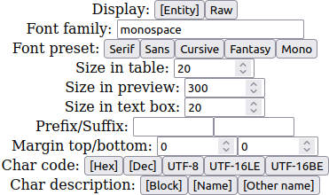

The parameters has the following meaning:


* **Display** \- Select the way of displaying characters in HTML code\. It may affect in some browsers\. Theoretically, both ways gives the same result\.
  * **Entity** \- Use &\#x; to write character in table and preview\.
  * **Raw** \- Write character directly in code in table and preview\.
* **Arrange** \- Enables or disables the module layout arrangement\.
  * **Yes** \- The separators are thick and you can swap any two modules by clicking the separator\.
  * **No** \- The separator are thin and you can not change the module order\.
* **Font family** \- Write system font name or downloadable font definition\. You can write any font name existing on system, such as Arial, Courier\.
* **Font preset** \- Select one of standard font families, available in every operating system and web browser\.
  * **Serif** \- serif
  * **Sans** \- sans\-serif
  * **Cursive** \- cursive
  * **Fantasy** \- fantasy
  * **Mono** \- monospace
* **Size in table** \- Font size in browser table bodule\.
* **Size in info** \- Font size in character information module\.
* **Size in text box** \- Font size in text box module\.
* **Variants in table** \- Displaying character in browser table\. You can view character variants using variation selectors\. The buttons works as multistate button as following:
  * **Txt** \- The text variant of the pictogram using **Variation Selector\-15**\.
  * **Std** \- Character without variation selector, displays the default shape\.
  * **Img** \- The image variant of the pictogram using **Variation Selector\-16**\.
  * **CJK1** \- The first variant of the character using **Variation Selector\-1**\.
  * **CJK2** \- The second variant of the character using **Variation Selector\-2**\.
  * **CJK3** \- The third variant of the character using **Variation Selector\-3**\.
  * **Layout** \- Character layout while at least two ways of display are enabled:
    * **H** \- Horizontal without space\.
    * **H\+S** \- Horizontal with space\.
    * **V** \- Vertical\.
* **Variants in info** \- Displaying character in character information\. Works in the same way as the **Variants in table**\.
* **Prefix/Suffix** \- The text before and after character\. This is usable to view character connected with other character, for example, to view diacritic charater used with the letter\.
* **Margin top/bottom** \- The number of blank lines above and below the character\. Some characters can have glyph outside of the box and the free space is needed to view such character clearly\.
* **Char code** \- Enable or disable character codes in character information:
  * **Hex** \- Hexadecimal number\.
  * **Dec** \- Decimal number\.
  * **UTF\-8** \- UTF\-8 byte sequence\.
  * **UTF\-16LE** \- UTF\-16 byte sequence using little endian order\.
  * **UTF\-16BE** \- UTF\-16 byte sequence using big endian order\.
* **Char description** \- Enable or disable character description elements in character information:
  * **Block** \- Block name and address if exists\.
  * **Name** \- Character name if exists\.
  * **Other name** \- Character other name if exisits\.

Every parameter will be saved and restored after application restart\.

# Complex characters

Some Unicode characters, especially some pictograms, consists of several elementary characters and are represented as sequence of elementary characters\. Most operating systems displays such sequence as single complex character\. Some elementary characters, such a variation selectors and zero\-width joiner are designed for make complex characters only\.

## Examples

There are examples of complex characters\. The rainbow flag pictogram consists of the following elementary characters including variation selector and zero\-width joiner\.


1. **01F3F3** \- Waving white flag
2. **FE0F** \- Variation selector\-16
3. **200D** \- Zero with joiner
4. **01F308** \- Rainbow

The colorful speech bubble can be achieved by speech bubble pictogram with variation selector:


1. **01F5E8** \- Left speech bubble
2. **FE0F** \- Variation selector\-16

Some character pais also may create complex characters\. For example, the Japan flag can be achieved by this sequence:


1. **01F1EF** \- Regional indicator symbol letter J
2. **01F1F5** \- Regional indicator symbol letter P

# Character finder

You can find any character from text or character by name using the search field:

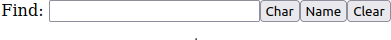

You can find characters by the following ways:


* Extract character from text\.
* Find by name\.
* Decode hex code \(not to be confused with character number\)\.

## Find by char

Paste or write text containing character, which you want to find, to the **Find** field and click the **Char** button\. There will be shown table, which has the same number of rows as the length of pasted text\. Every row has information about one elementary character\.

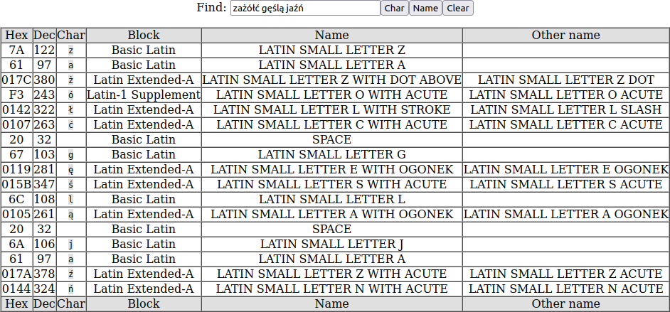

If you input \(paste\) text containing complex characters, there will be shown the complex characters in the find result table\.

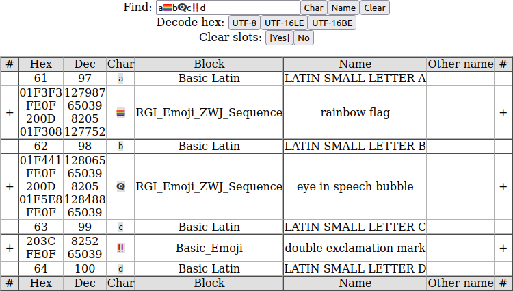

In such case, you can display elementary character by clicking the **\+** sign in the **\#** column\.

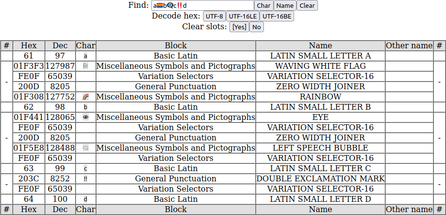

If you click the **\-** sign in the **\#** column, the elementary character list will be returned to complex character\.

## Find by name

Most Unicode characters has the following attributes:


* Block name
* Main character name
* Other character name

You can find by value of on from the three attributes\. The characters will be searched according the rules:


* The phrases are splitted into words by spaces\.
* If word does not begin with **~** ir **\!** character, the word must exist in at least one of mentioned character attributes\.
* If word begins with **~** ir **\!** character, the word must not exist in all of mentioned character attributes\.

Input the phrase of the name in the **Find** field and click the **Name** button\. There will be show table containing all characters, which name contains the text in the **Find** field\.

The search is not case sensitive, in the most cases, you will search the characters by words, which must exists\.

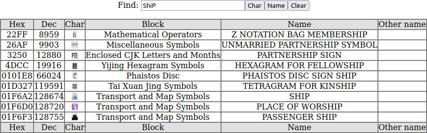

Some characters are defined as complex character in the **emoji\-sequences\.txt** file consisting of one elementary character, so some characters are displayes as complex characters and works as every complex character\.

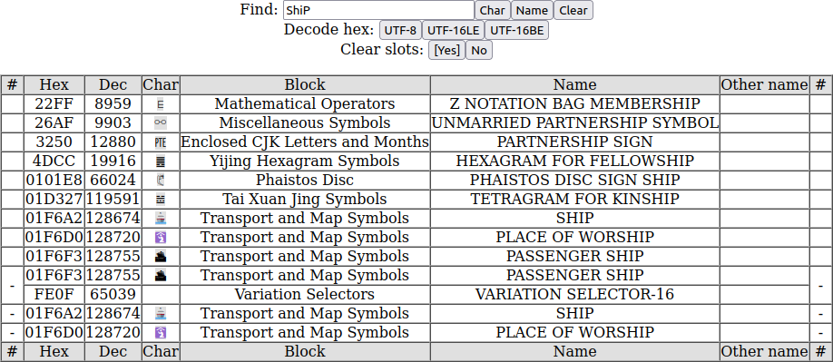

You can include other words by spaces:

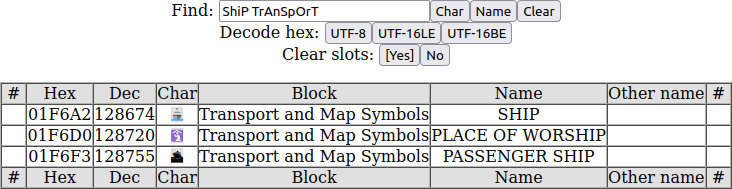

Using the **~** or **\!** character, you can exclude some words:

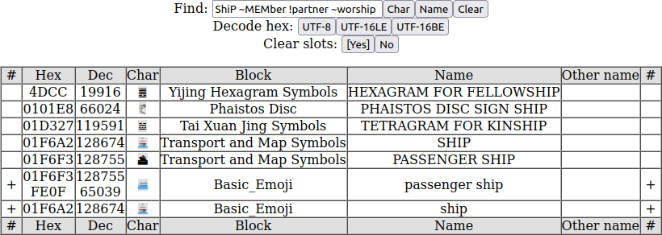

## Clear field and table

You can click the **Clear** button to disappear the find result table and clear the **Find** field\.

## Result table

If you click the **Char** or **Name** button, there will be show the find result table\. If you click the row in the table, you will be redirected to the character, which is in the row\. To clear the result table, you can click the **Clear** button\. If you select any complex character, the character will be occupy more slots beginning from the current\.

## Clear slots

Most complex characters occupies more than one slot\. If you browse characters using character finder module, you can automatically clear other slots when you select other character\. You can set this property int the **Clear slots** field by clicking the **Yes** or **No** button\.

## Decoding UTF sequence

Using the **Find** field, you can decode any UTF\-8 or UTF\-16 byte sequence\. The sequence must be written in the **Find** field as hexadecimal numbers, without BOM\. Characters other than digits and letters from **A** to **F** will be ignored \(letters can be both lowercase or uppercase\)\. The sequence must contain even number of hexadecimal numbers\. To decode, you have to click one of the buttons below:


* **UTF\-8** \- Decode UTF\-8 sequence\.
* **UTF\-16LE** \- Decode UTF\-16 sequence using little endian byte order\.
* **UTF\-16BE** \- Decode UTF\-16 sequence using big endian byte order\.

There is example showing decoding the same character sequence written using all supported encodings\.

The UTF\-8 sequence:

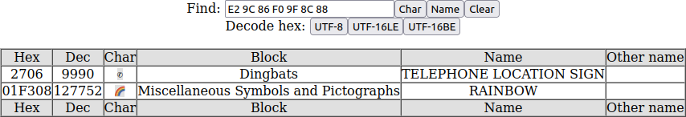

The UTF\-16 little endian sequence:


The UTF\-16 big endian sequence:


# Derivative scharacters

You can show all derivative characters for every ASCII character \(character number from **0x20** to **0x7E**\)\. You have to input such character alone and click the **Char** button\. If you input character outside from **0x20** to **0x7E**, there will be work as ordinary find by char\. In the result there will be shown all derivative characters for the ASCII character\.

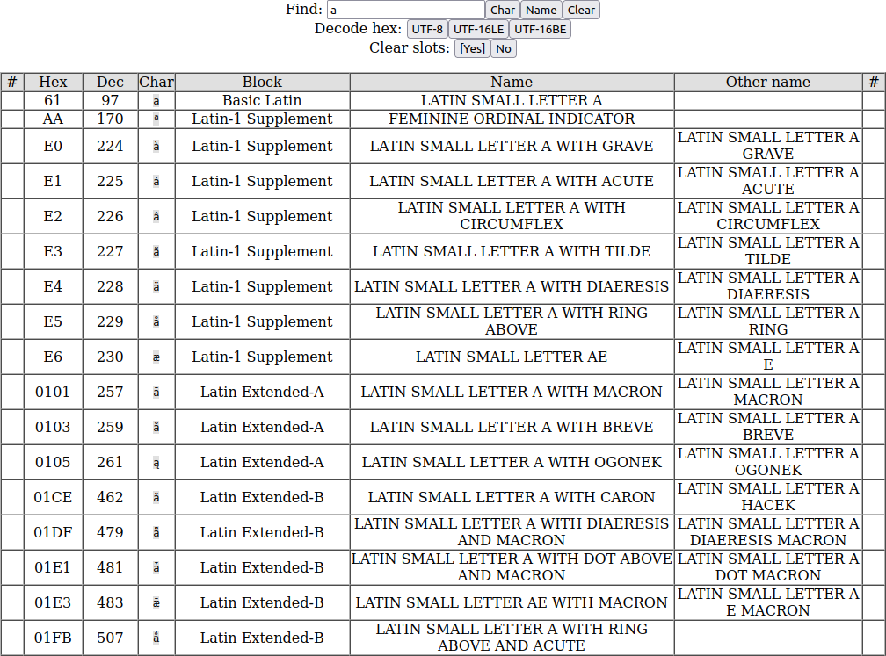

The characters are found by analyzing the character name\. The algorithm is described with details in the **readme\_ascii\.md** file\.

# Browser table and navigator

The main puspose of the application is browsing the Unicode characters\. The browser table shows one page consisting of 256 characters\.


The full Unicode character set consists of 17 planes, every plane consists of 256 pages\. In the navigator module, there are the 10\-button set, which allows to navigate between planes and pages\.

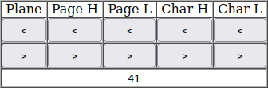

The buttons are gouped as following:


* **Plane** \- Go across 1 plane\.
* **Page H** \- Go across 16 pages \(high half of page number\)\.
* **Page L** \- Go across 1 page \(low half of page number\)\.
* **Char H** \- Go across 16 characters \(high half of page number, horiz\)\.
* **Char L** \- Go across 1 character \(low half of page number\)\.

You can also manually input hexadecimal character number in the text field directly below the buttons\. If the number is not valid or exceedes the **10FFFF**, the character will not be changed\. The character table consists of 256 characters arranged row by row\. You can input the number with double underscore character to get page with unselected character\. For example:


* **20** \- Space character\.
* **\_\_** \- Page **00** of plane **00**, character not selected\.
* **26C6** \- Rain character\.
* **26\_\_** \- Page **26** of plane **00**, character not selected\.

Instead of **\_** \(underscore\) character, you can use the **\-** \(minus\) or **\*** \(asterisk\)\. The **26\_\_**, **26\-\-** and **26\*\*** has the same meaning\.

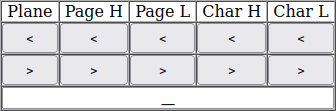

You can also unselect character by clicking on the table header\. This feature is important in browsing complex characters\.

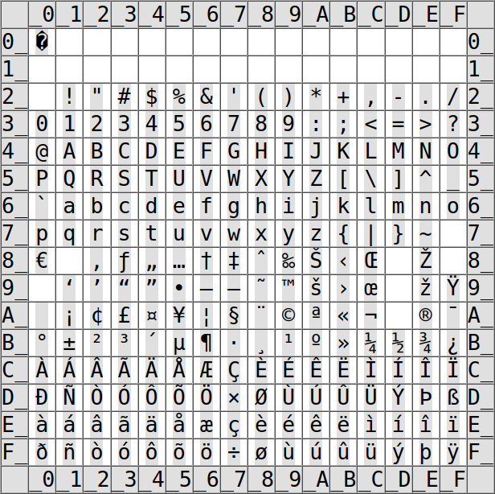

## Occupying box

In all modules, where character is showv, gray box behind character represents the area, whis is occupied by the character\. Some character glyphs may be outside the occupying box\.

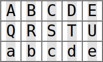

The prefix and suffix are outside of the box\.

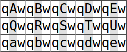

Some diacritic chars has no occupying box, so such characters may be partially outside of the table cell\. For better readibility and visibility, you can input some text in the **Prefix/Suffix** fields\.

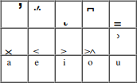

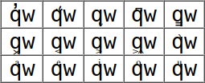

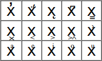

A few characters may have glyph parts above or unter occupying box\.

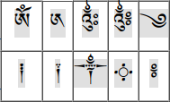

For better readibility and visibility such characters, increase the margin in **Margin top/bottom** fields\.

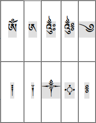

# Character information

To view zoomed character and character name, you can select the character by these ways:


1. Navigate to the character using navigator buttons or inputting the character number\.
2. Click the character in the browser table\.
3. Click the item in the character finder results\.

After selecting the character, the information will be shown in the information module\.

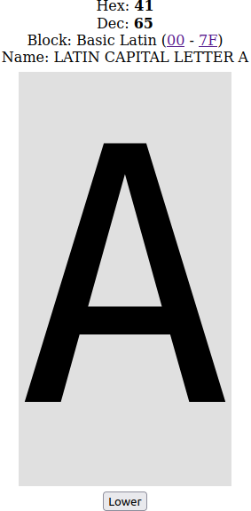

The details will be displayed below the table and lower navigation buttons\. This details includes:


* Number in decimal system for elementary characters or number sequence for complex characters\.
* Number in hexadecimal system for elementary characters or number sequence for complex characters\.
* Block name \(the named set consisting of some character serie\) and code range \(which allows to redirect to first and last character\)\.
* Character names\.
* Zoomed in character \(the size can be changed in the **Size in info** field\)\.

Some character has defined the lowercase, uppercase or title equivalent\. If you viewing such character, below the preview, there can be shown one or two of the following buttons:


* **Upper** \- Redirects to the uppercase equivalent\.
* **Lower** \- Redirects to the lowercase equivalent\.
* **Title** \- Redirects to the equivalent suitable to use in title\.

## Complex character info

In the character information, if there is displayed complex character or character sequence, the character code consists of all elementary character codes splitted by **&#124;** character\. The bolded part of character code sequence indicates character selected in the current slot\. The character information also describes the character selected in the current slot\.

Character information, when the slot of first elementary character is selected:

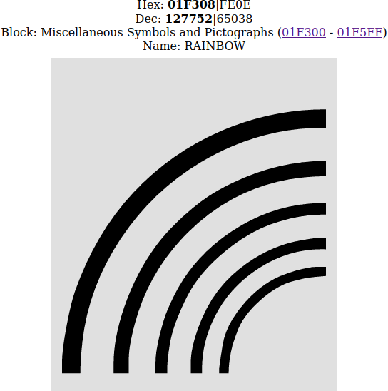

Character information, when the slot of second elementary character is selected:

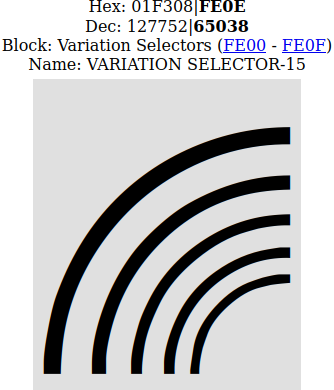

# Browser slots

The character browser has independed slots, which can be browsed using eight buttons in the slot module\. The **<** and **>** buttons allows to scroll the slots\. If tharacter number ends with double underscore, this slot has selected page, but character is not selected\. The characters displayed are the character composited from all slots with selected characters\. If you want to browse elementary characters, you have to be sure, that on every other slot character is not selected\. You can unselect character by clicking on the table header or input code ending of double underscore, double minus or double asterisk\.

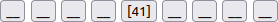

You can change the current slot by clicking the buttons\. The current slot selection will be indicated by **\[** and **\]** characters\. You can scroll the slots by clicking the **<** and **>** buttons\.

If there is selected other page than **00** on the other slots, you will also browse the elementary characters\. For example, you can use the variation selectors on the page **FE**\. You can prepare the page on the next slot\.


On the page **F3** on the plane **01**, you will see the standard version of pictograms\.

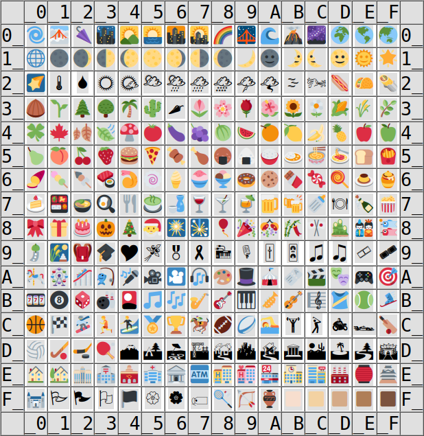

If you select the **Variation selector 16**, you can see another version of some characters\.


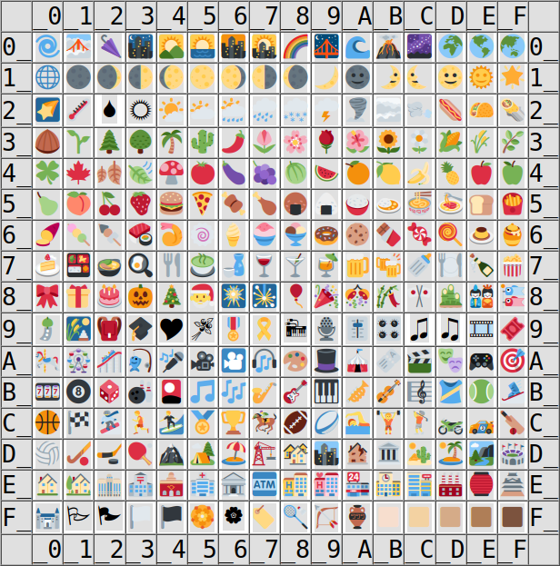

By the same way, the **Variation selector 15** also changes the pictogram fashion\.

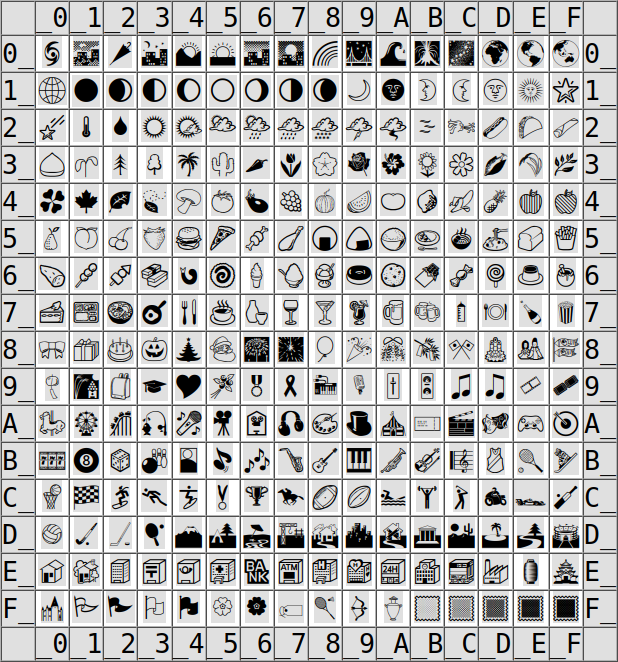


# Character variants

In most operating systems and web browsers, there are implemented two variants of most pictogram characters:


* **Text** \- display as ordinary monochrome charcter, which is picture\-shaped\.
* **Image** \- display as colorful image\.

Some CJK characters has up to three variants:


* **CJK1** \- Variant 1
* **CJK2** \- Variant 2
* **CJK3** \- Variant 3

The default variants varies from character to character\.

You can force to display text or image variant for pictogram or force one of the three variants of CJK character\.

You can display possible variants using the buttons in **Variants in table** and **Variants in info** fields\. Both fields has the same work mechanism, but the first works in the table, the second works in the info\.

In order to enable or disable the text or image variants of the pictogram character, click the **Txt** or **Img** button\. The **Std** button allows show or hide the standard display\.

In order to display other variants of the CJK character, click the **CJK1** or **CJK2** or **CJK3** button\.

Displaying text/image and CJK variants at once is not possible and it makes no sense, because none of pictogram character has CJK variants and none of CJK characters has text/image variants\.

The enforcement is made using variation selector characters:


* **Text** \- FE0E \(Variation Selector\-15\)
* **Image** \- FE0F \(Variation Selector\-16\)
* **CJK1** \- FE00 \(Variation Selector\-1\)
* **CJK2** \- FE01 \(Variation Selector\-2\)
* **CJK3** \- FE02 \(Variation Selector\-3\)

The character composition using characters from the other slots are displayed on standard variant only using **Std** button\. Other variants uses character from current slot only\.

There is page 01F3 display using the text and image variants, without the standard variant\.

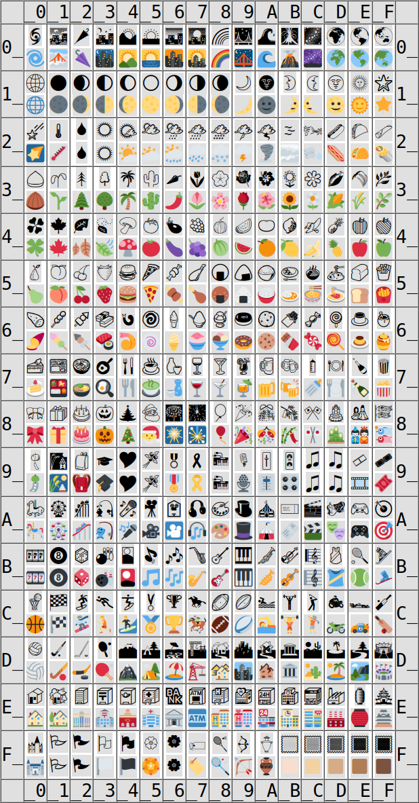

# Font attributes

You can set the font attributes using the buttons above and below the character table\.

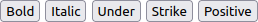

There are available attributes:


* **Bold** \- Font bold style
* **Italic** \- Font italic style
* **Under** \- Text underline
* **Strike** \- Text strikethrough
* **Positive** or **Negative** \- Swaps between two display states, the current button caption indicates the current state:
  * **Positive** \- Black character on the white background and bright occupying box\.
  * **Negative** \- White character on the black background and dark occupying box\.

For the first four buttons \(**Bold**, **Italic**, **Under**, **Strike**\), if attribute is enabled, the brackets will be arount the button caption\. The button swaps between enabled and disabled attribute state\.

The font style will be affected in the following places:


* Character table \(described above\)\.
* Character preview \(described above\)\.
* Finding result table \(described below\)\.
* Text box field \(described below\)\.

The **Positive**/**Negative** attribute will help to distinguish the colorful pictogram characters from regular characters, which colors changes according the attribute\. If the pictogram character has colors similar to occupying box or background, the **Positive**/**Negative** switching may help to clearly view the pictogram

# Text box

Below the character preview there is the large text box, which allows to input any text using selected font and selected attributes\.

You can manually write or paste any text to show, how the text looks using selected font\.

## Buttons above text box \- upper row

You can also input the unicode characters using the buttons above the text box\.

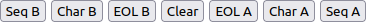

The buttons are following:


* **Seq B** \- Write character with prefix and suffix before existing text\.
* **Char B** \- Write character without prefix and suffix before existing text\.
* **EOL B** \- Write end\-of\-line before existing text\.
* **Clear** \- Clear the text box\.
* **EOL A** \- Write end\-of\-line after existing text\.
* **Char A** \- Write character without prefix and suffix after existing text\.
* **Seq A** \- Write character with prefix and suffix after existing text\.

## Complex characters

You can use the text box to generate complex characters without using browser slots, which are defined in Unicode standard and implemented in user web browser\.

For example, you can write complex character by the following sequence:


1. Click the **Clear** button, the text box will be blank\.
2. Select the **200D** character \(zero with joiner\)\.
3. Click the **Char A** button, there text box will seem be blank, but it will contain single invisible character\.
4. Select the **01F308** character \(rainbow pictogram\)\.
5. Click the **Char A**, there will be shown the rainbow pictogram\.
6. Select the **FE0F** character \(Variation Selector\-16\)\.
7. Click the **Char B**, the one more invisible character will be added\.
8. Select the **01F3F3** character \(waving white flag character\)\.
9. Click the **Char B**, the rainbow pictogram will be replaced with the rainbow flag pictogram\.

The replacement at the step 8 will be done, because there will be written full sequence of complex character\.

## Buttons above text box \- lower row

You can write the current character page \(256 characters\) using the buttons in the lower row, above text box\.

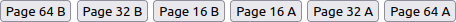

These buttons are the following functions:


* **Page 64 B** \- Write the current page before existing text as 64x4 layout\.
* **Page 32 B** \- Write the current page before existing text as 32x8 layout\.
* **Page 16 B** \- Write the current page before existing text as 16x16 layout\.
* **Page 16 A** \- Write the current page after existing text as 16x16 layout\.
* **Page 32 A** \- Write the current page after existing text as 32x8 layout\.
* **Page 64 A** \- Write the current page after existing text as 64x4 layout\.

## Buttons below text box \- upper row

The buttons below the text box are the system buttons\.

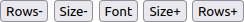

The functions are following:


* **Rows\-** \- Decrease the row number of text box \.
* **Size\-** \- Decrease the font size\.
* **Font** \- Copy text box contents into the Font family field, usable when you define the downloadable font \(described below\)\.
* **Size\+** \- Increase the font size\.
* **Rows\+** \- Increase the row number of text box\.

## Buttons below text box \- lower row

You can convert the text existing in text box into the ASCII version replacing derivative characters to ASCII characters\.

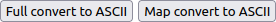

There are two conversion ways:


* **Full convert to ASCII** \- Replace derivative characters with ASCII and replace other non\-ASCII characters with **?** character\.
* **Map convert to ASCII** \- Replace derivative characters with ASCII only\.
* **Show non\-convertible to ASCII** \- Replace ASCII characters and derivative characters with **?** character\. There will be remain non\-convertible characterss only\.

During the conversion, there are used the same algorithm for derivative character finding for specified ASCII character\. At the first time, the conversion may take a while, because the application builds the conversion map\. If the browser suggests to break the script, please allow to continue and wait\. Usually, the time is not longer than 120 seconds\. The derivative character finding is detailed in the **readme\_ascii\.md** file\.

# Downloadable web font

The application allows to view downloadable web font\. This requires preparation special code as font family\. To make this easier, you can prepare downloadable font code in text box and click the **Font** button to copy this text into the **Font family** field\. The end\-of\-line characters will be ignored\.

## Font code structure

The code structure is the serie consisting of even number of strings separated by **&#124;** character \(vertical bar\)\. The whole code must contain odd number of **&#124;** characters\. Each record consists of two strings\. The first string specifies font format and character range and the second string of record specifies the font file URL\.

The font type and character range are not mandatory\. The simplest downloadable font definition can be following:

```
|http://www.someserver.com/somefontfile.woff2
```

If you want to provide the font file type, the font code will be as following:

```
woff2|http://www.someserver.com/somefontfile.woff2
```

If you want to provide two files with types, the font code will be following:

```
woff2|http://www.someserver.com/somefontfile1.woff2|woff2|http://www.someserver.com/somefontfile2.woff2
```

For more readibility, you can prepare the code using end\-of\-line character\. The following three codes are exactly the same code:

```
woff2|http://www.someserver.com/somefontfile1.woff2|
woff2|http://www.someserver.com/somefontfile2.woff2
```

```
woff2|http://www.someserver.com/somefontfile1.woff2
|woff2|http://www.someserver.com/somefontfile2.woff2
```

```
woff2|http://www.someserver.com/somefontfile1.woff2
|
woff2|http://www.someserver.com/somefontfile2.woff2
```

If you paste this code into the text box at the bottom of page and clich the **Font** button, the text will be copied into the **Font family** field with removing all end\-of\-line characters\.

The character range definition always begins from the **?** character \(question mark\) and syntax accords to the CSS **unicode\-range** attribute\. If you provide single font file, the character range is not necessary\. For example, assume, that the first file covers the characters from **0020** to **007C** and the second file covers from **0400** to **04FF** characters\. In this case, the font code will be as following:

```
woff2?U+0000-007C|http://www.someserver.com/somefontfile1.woff2|
woff2?U+0400-04FF|http://www.someserver.com/somefontfile2.woff2
```

The **unicode\-range** syntax are following:


* The single value is **U\+1234** \- the **U\+** prefix followed by the hexadecimal number\.
* The single range is **U\+1234\-5678** \- the **U\+** prefix followed by the lower hexadecimal number, the minus sign and the upper hexadecimal number\.
* You can write single value/range or multiple values/ranges separated by comma\. You can mix values and ranges\.

The character range definition syntax will not be checked and will be passed to CSS style as is\.

## Font code example

Assume, that you want to view the [**Fruggles**](https://fonts.google.com/specimen/Fuggles "https://fonts.google.com/specimen/Fuggles") font from the **Google** library\. For every font, Google provides font files and CSS definition, which easies making the font code\.

At the font preview, you will generate the **style** code\. Inside this code, there will be font URL:

[https://fonts\.googleapis\.com/css2?family=Fuggles&display=swap](https://fonts.googleapis.com/css2?family=Fuggles&display=swap "https://fonts.googleapis.com/css2?family=Fuggles&display=swap")

If you open the url, you will view the following text:

```
/* vietnamese */
@font-face {
  font-family: 'Fuggles';
  font-style: normal;
  font-weight: 400;
  font-display: swap;
  src: url(https://fonts.gstatic.com/s/fuggles/v1/k3kQo8UEJOlD1hpOfdboLnnA.woff2) format('woff2');
  unicode-range: U+0102-0103, U+0110-0111, U+0128-0129, U+0168-0169, U+01A0-01A1, U+01AF-01B0, U+1EA0-1EF9, U+20AB;
}
/* latin-ext */
@font-face {
  font-family: 'Fuggles';
  font-style: normal;
  font-weight: 400;
  font-display: swap;
  src: url(https://fonts.gstatic.com/s/fuggles/v1/k3kQo8UEJOlD1hpOfdfoLnnA.woff2) format('woff2');
  unicode-range: U+0100-024F, U+0259, U+1E00-1EFF, U+2020, U+20A0-20AB, U+20AD-20CF, U+2113, U+2C60-2C7F, U+A720-A7FF;
}
/* latin */
@font-face {
  font-family: 'Fuggles';
  font-style: normal;
  font-weight: 400;
  font-display: swap;
  src: url(https://fonts.gstatic.com/s/fuggles/v1/k3kQo8UEJOlD1hpOfdnoLg.woff2) format('woff2');
  unicode-range: U+0000-00FF, U+0131, U+0152-0153, U+02BB-02BC, U+02C6, U+02DA, U+02DC, U+2000-206F, U+2074, U+20AC, U+2122, U+2191, U+2193, U+2212, U+2215, U+FEFF, U+FFFD;
}
```

As you can see, the Fruggles font consists of 3 separate files\. Every item begins with the **@font\-face** element\. Within every element, there are two important elements:


* **src** \- The font file URL and file format\.
* **unicode\-range** \- The characters covered by this file\.

It is recommended to prepare the blank font code for three items\.

```
|
|
|
|
|
```

The next step is paste the file URL and file type\.

```
woff2|https://fonts.gstatic.com/s/fuggles/v1/k3kQo8UEJOlD1hpOfdboLnnA.woff2
|
woff2|https://fonts.gstatic.com/s/fuggles/v1/k3kQo8UEJOlD1hpOfdfoLnnA.woff2
|
woff2|https://fonts.gstatic.com/s/fuggles/v1/k3kQo8UEJOlD1hpOfdnoLg.woff2
```

Theoretically, you can use code presented above and may be displayed correctly, but this code has not information about character coverage\. You can also use single item as whole font code to test coverage\. In this exaple, there are valit three font codes:

```
woff2|https://fonts.gstatic.com/s/fuggles/v1/k3kQo8UEJOlD1hpOfdboLnnA.woff2
```

```
woff2|https://fonts.gstatic.com/s/fuggles/v1/k3kQo8UEJOlD1hpOfdfoLnnA.woff2
```

```
woff2|https://fonts.gstatic.com/s/fuggles/v1/k3kQo8UEJOlD1hpOfdnoLg.woff2
```

To set the character coverage, write the **?** character after every file type definition\.

```
woff2?|https://fonts.gstatic.com/s/fuggles/v1/k3kQo8UEJOlD1hpOfdboLnnA.woff2
|
woff2?|https://fonts.gstatic.com/s/fuggles/v1/k3kQo8UEJOlD1hpOfdfoLnnA.woff2
|
woff2?|https://fonts.gstatic.com/s/fuggles/v1/k3kQo8UEJOlD1hpOfdnoLg.woff2
```

Then, paste the **unicode\-range** value for each font file, without the semicolon:

```
woff2?U+0102-0103, U+0110-0111, U+0128-0129, U+0168-0169, U+01A0-01A1, U+01AF-01B0, U+1EA0-1EF9, U+20AB|https://fonts.gstatic.com/s/fuggles/v1/k3kQo8UEJOlD1hpOfdboLnnA.woff2
|
woff2?U+0100-024F, U+0259, U+1E00-1EFF, U+2020, U+20A0-20AB, U+20AD-20CF, U+2113, U+2C60-2C7F, U+A720-A7FF|https://fonts.gstatic.com/s/fuggles/v1/k3kQo8UEJOlD1hpOfdfoLnnA.woff2
|
woff2?U+0000-00FF, U+0131, U+0152-0153, U+02BB-02BC, U+02C6, U+02DA, U+02DC, U+2000-206F, U+2074, U+20AC, U+2122, U+2191, U+2193, U+2212, U+2215, U+FEFF, U+FFFD|https://fonts.gstatic.com/s/fuggles/v1/k3kQo8UEJOlD1hpOfdnoLg.woff2
```

The font code is fully generated\. The last step is paste this code into text box and click the **Font** button\. If the code is created correctly, the characters will be displayed using this font\.

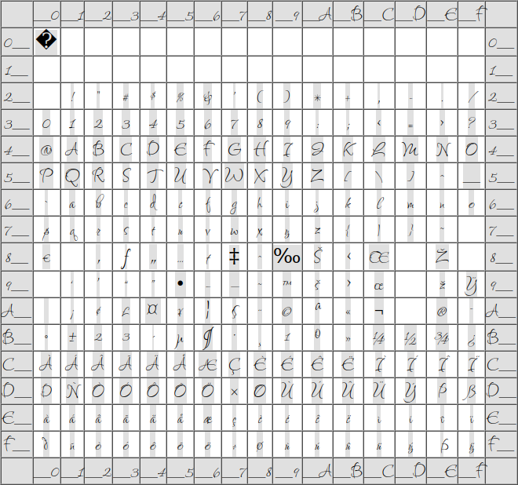


