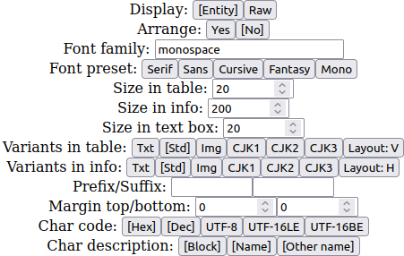
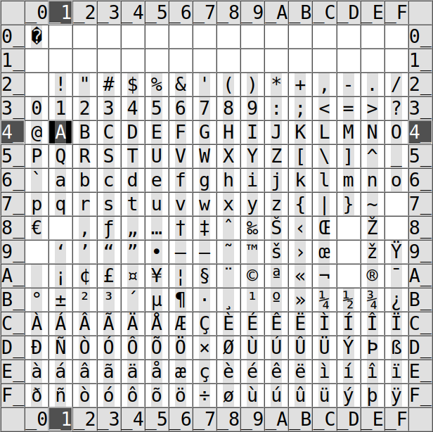
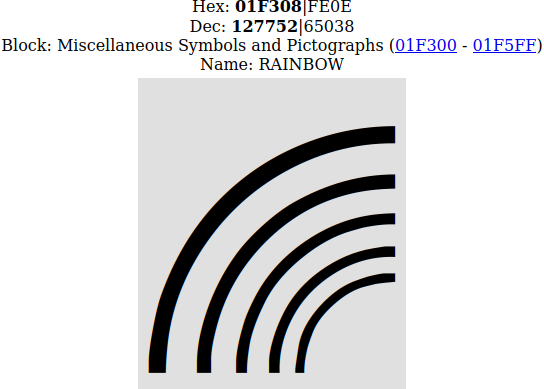
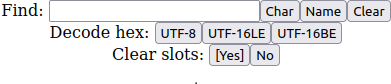
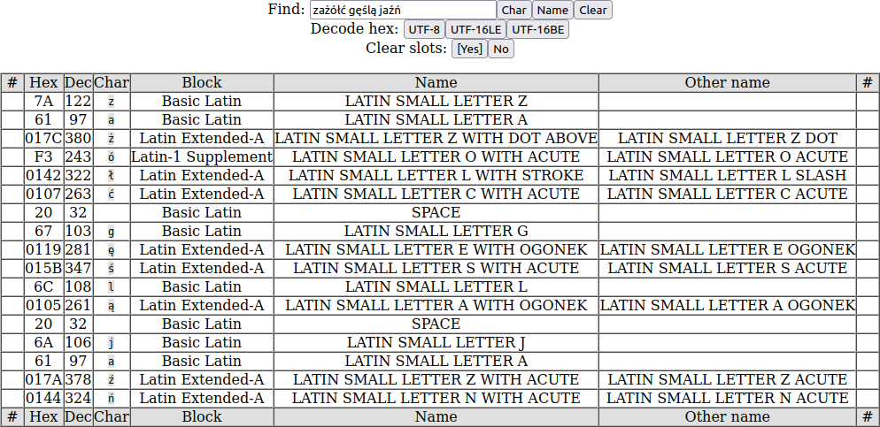
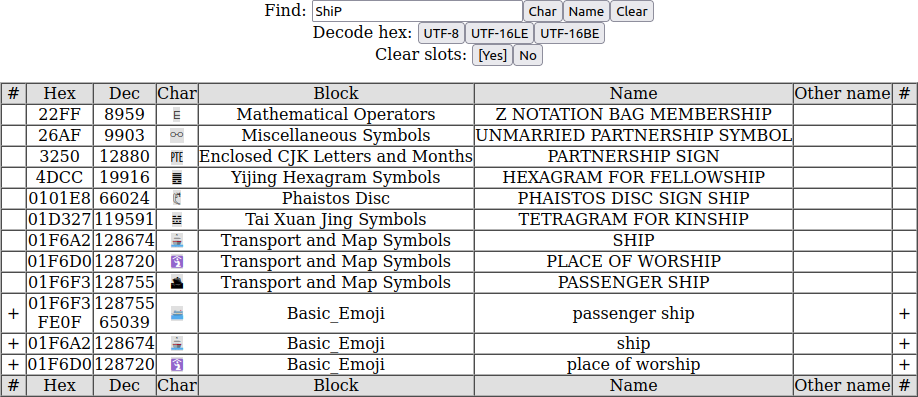
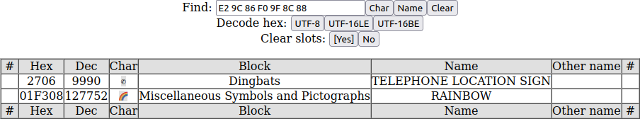
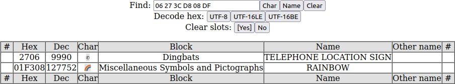

# Unicode browser

There is simple application, wchich has following abilities and purposes:


* Browse Unicode characters by code\.
* Find codes of characters used in text\.
* Find character by name\.
* Preview characters connected with other characters\.
* Collect unicode characters as text to copy\.
* Test system fonts and downloadable fonts\.
* Write text using specified font\.

This application should work on every HTML5\-complaint browser and can be run by opening the **unicode\.htm** file\.

It uses data generated from the two Unicode official files for character definitions:


* [https://unicode\.org/Public/UNIDATA/Blocks\.txt](https://unicode.org/Public/UNIDATA/Blocks.txt "https://unicode.org/Public/UNIDATA/Blocks.txt")
* [https://unicode\.org/Public/UNIDATA/UnicodeData\.txt](https://unicode.org/Public/UNIDATA/UnicodeData.txt "https://unicode.org/Public/UNIDATA/UnicodeData.txt")

The application contains the generator\.htm file, which helps in updating the character definitions\.

The application is available online from the address: [https://andrzejlisek\.github\.io/Unicode/unicode\.htm](https://andrzejlisek.github.io/Unicode/unicode.htm "https://andrzejlisek.github.io/Unicode/unicode.htm")

# Basic parameters

At the top of the page, there are basic parameters\.



The parameters has the following meaning:


* **Display** \- Select the way of displaying characters in HTML code\. It may affect in some browsers\. Theoretically, both ways gives the same result\.
  * **Entity** \- Use &\#x; to write character in table and preview
  * **Raw** \- Write character directly in code in table and preview
* **Font family** \- Write system font name or downloadable font definition\. You can write any font name existing on system, such as Arial, Courier\.
* **Font preset** \- Select one of standard font families, available in every operating system and web browser\.
  * **Serif** \- serif
  * **Sans** \- sans\-serif
  * **Cursive** \- cursive
  * **Fantasy** \- fantasy
  * **Mono** \- monospace
* **Size in table** \- Font size in character table\.
* **Size in preview** \- Font size in character preview shown below table\.
* **Size in text box** \- Font size in text box at the bottop of this page\.
* **Prefix/Suffix** \- The text before and after character\. This is usabe to view character connected with other character, for example, to view diacritic charater used with the letter\.
* **Margin top/bottom** \- The number of blank lines above and below the character\. Some characters can have glyph outside of the box and the free space is needed to view such character clearly\.
* **Char code** \- Enable or disable character codes in character information:
  * **Hex** \- Hexadecimal number\.
  * **Dec** \- Decimal number\.
  * **UTF\-8** \- UTF\-8 byte sequence\.
  * **UTF\-16LE** \- UTF\-16 byte sequence using little endian order\.
  * **UTF\-16BE** \- UTF\-16 byte sequence using big endian order\.
* **Char description** \- Enable or disable character description elements in character information:
  * **Block** \- Block name and address if exists\.
  * **Name** \- Character name if exists\.
  * **Other name** \- Character other name if exisits\.

Every parameter will be saved and restored after application restart\.

# Browsing and viewing the characters

The main puspose of the application is browsing the Unicode characters\. The browser shows one page consisting of 256 characters\.



The full Unicode character set consists of 17 planes, every plane consists of 256 pages\. The above and below the character page, there are the 10\-button set, which allows to navigate between planes and pages\.


The buttons are gouped as following:


* **Plane** \- Go across 1 plane\.
* **Page H** \- Go across 16 pages \(high half of page number\)\.
* **Page L** \- Go across 1 page \(low half of page number\)\.
* **Char H** \- Go across 16 characters \(high half of page number, horiz\)\.
* **Char L** \- Go across 1 character \(low half of page number\)\.

You can also manually input hexadecimal character number in the text field directly below the buttons\. If the number is not valid or exceedes the **10FFFF**, the character will not be changed\. The character table consists of 256 characters arranged row by row\. You can input the number with double underscore character to get page with unselected character\. For example:


* **20** \- Space character\.
* **\_\_** \- Page **00** of plane **00**, character not selected\.
* **26C6** \- Rain character\.
* **26\_\_** \- Page **26** of plane **00**, character not selected\.

Instead of **\_** \(underscore\) character, you can use the **\-** \(minus\) or **\*** \(asterisk\)\. The **26\_\_**, **26\-\-** and **26\*\*** has the same meaning\.


You can also unselect character by clicking on the table header\. This feature is important in browsing complex characters\.


## Occupying box

The gray box behind character represents the area, whis is occupied by the character\. Some character glyphs may be outside the occupying box\.


The prefix and suffix are outside of the box\.


Some diacritic chars has no occupying box, so such characters may be partially outside of the table cell\. For better readibility and visibility, you can input some text in the **Prefix/Suffix** fields\.


A few characters may have glyph parts above or unter occupying box\.


For better readibility and visibility such characters, increase the margin in **Margin top/bottom** fields\.


## Character info

To view zoomed character and character name, you can click the character in the character table or select character using navigation buttons above or below character table\.


The details will be displayed below the table and lower navigation buttons\. This details includes:


* Number in decimal system for elementary characters or number sequence for complex characters\.
* Number in hexadecimal system for elementary characters or number sequence for complex characters\.
* Block name \(the named set consisting of some character serie\) and code range \(which allows to redirect to first and last character\)\.
* Character names\.
* Zoomed in character \(the size can be changed in the **Size in preview** field\)\.

Some character has defined the lowercase, uppercase or title equivalent\. If you viewing such character, below the preview, there can be shown one or two of the following buttons:


* **Upper** \- Redirects to the uppercase equivalent\.
* **Lower** \- Redirects to the lowercase equivalent\.
* **Title** \- Redirects to the equivalent suitable to use in title\.

## Font attributes

You can set the font attributes using the buttons above and below the character table\.


There are available attributes:


* **Bold** \- Font bold style
* **Italic** \- Font italic style
* **Under** \- Text underline
* **Strike** \- Text strikethrough
* **Positive** or **Negative** \- Swaps between two display states, the current button caption indicates the current state:
  * **Positive** \- Black character on the white background and bright occupying box\.
  * **Negative** \- White character on the black background and dark occupying box\.

For the first four buttons \(**Bold**, **Italic**, **Under**, **Strike**\), if attribute is enabled, the brackets will be arount the button caption\. The button swaps between enabled and disabled attribute state\.

The font style will be affected in the following places:


* Character table \(described above\)\.
* Character preview \(described above\)\.
* Finding result table \(described below\)\.
* Text box field \(described below\)\.

The **Positive**/**Negative** attribute will help to distinguish the colorful pictogram characters from regular characters, which colors changes according the attribute\. If the pictogram character has colors similar to occupying box or background, the **Positive**/**Negative** switching may help to clearly view the pictogram

# Complex characters

Some Unicode characters, especially some pictograms, consists of several elementary characters and are represented as sequence of elementary characters\. Most operating systems displays such sequence as single complex character\. Some elementary characters, such a variation selectors and zero\-width joiner are designed for make complex characters only\.

## Examples

There are examples of complex characters\. The rainbow flag pictogram consists of the following elementary characters including variation selector and zero\-width joiner\.


1. **01F3F3** \- Waving white flag
2. **FE0F** \- Variation selector\-16
3. **200D** \- Zero with joiner
4. **01F308** \- Rainbow

The colorful speech bubble can be achieved by speech bubble pictogram with variation selector:


1. **01F5E8** \- Left speech bubble
2. **FE0F** \- Variation selector\-16

Some character pais also may create complex characters\. For example, the Japan flag can be achieved by this sequence:


1. **01F1EF** \- Regional indicator symbol letter J
2. **01F1F5** \- Regional indicator symbol letter P

## Browser slots

The character browser has 9 independed slots indicated as buttons below the character information\. Every button shows the character number selected in this slot\. If tharacter number ends with double underscore, this slot has selected pade, but character is not selected\. The characters displayed are the character composited from all slots with selected characters\. If you want to browse elementary characters, you have to be sure, that on every other slot character is not selected\. You can unselect character by clicking on the table header or input code ending of double underscore, double minus or double asterisk\.


You can change the current slot by clicking the buttons\. The current slot selection will be indicated by **\[** and **\]** characters\. You can move character selection in all slots by clicking the **<** and **>** buttons\.

If there is selected other page than **00** on the other slots, you will also browse the elementary characters\. For example, you can use the variation selectors on the page **FE**\. You can prepare the page on the next slot\.


On the page **F3** on the plane **01**, you will see the standard version of pictograms\.


If you select the Variation selector 16, you can see another version of some characters\.


By the same way, the Variation selector 15 also changes the pictogram fashion\.


## Complex character info

In the character information, if there is displayed complex character or character sequence, the character code consists of all elementary character codes splitted by **&#124;** character\. The bolded part of character code sequence indicates character selected in the current slot\. The character information also describes the character selected in the current slot\.

Character information, when the slot of first elementary character is selected:



Character information, when the slot of second elementary character is selected:


# Finding the characters

You can find any character from text or character by name using the search field:



## Find by char

Paste or write text containing character, which you want to find, to the **Find** field and click the **Char** button\. There will be shown table, which has the same number of rows as the length of pasted text\. Every row has information about one elementary character\.



If you input \(paste\) the complex character, there will be shown the elementary characters in the find result table\.


## Find by name

Most Unicode characters has the following attributes:


* Block name
* Main character name
* Other character name

You can find by value of on from the three attributes\. The characters will be searched according the rules:


* The phrases are splitted into words by spaces\.
* If word does not begin with **~** ir **\!** character, the word must exist in at least one of mentioned character attributes\.
* If word begins with **~** ir **\!** character, the word must not exist in all of mentioned character attributes\.

Input the phrase of the name in the **Find** field and click the **Name** button\. There will be show table containing all characters, which name contains the text in the **Find** field\.

The search is not case sensitive, in the most cases, you will search the characters by words, which must exists\.



You can include other words by spaces:


Using the **~** or **\!** character, you can exclude some words:


## Clear field and table

You can click the **Clear** button to disappear the find result table and clear the **Find** field\.

## Result table

If you click the **Char** or **Name** button, there will be show the find result table\. If you click the row in the table, you will be redirected to the character, which is in the row\. To clear the result table, you can click the **Clear** button\.

# Decoding UTF

Using the **Find** field, you can decode any UTF\-8 or UTF\-16 byte sequence\. The sequence must be written in the **Find** field as hexadecimal numbers\. Characters other than digits and letters from **A** to **F** will be ignored\. The sequence must contain even number of hexadecimal numbers\. To decode, you have to click one of the buttons below:


* **UTF\-8** \- Decode UTF\-8 sequence\.
* **UTF\-16LE** \- Decode UTF\-16 sequence using little endian byte order\.
* **UTF\-16BE** \- Decode UTF\-16 sequence using big endian byte order\.

## Decode examples

The below, there is show decoding the same character sequence written using all supported encodings\.

The UTF\-8 sequence:



The UTF\-16 little endian sequence:



The UTF\-16 big endian sequence:


# Text box

Below the character preview there is the large text box, which allows to input any text using selected font and selected attributes\.

You can manually write or paste any text to show, how the text looks using selected font\.

## Buttons above text box

You can also input the unicode characters using the buttons above the text box\.


The buttons are following:


* **Seq B** \- Write character with prefix and suffix before existing text\.
* **Char B** \- Write character without prefix and suffix before existing text\.
* **EOL B** \- Write end\-of\-line before existing text\.
* **Clear** \- Clear the text box\.
* **EOL A** \- Write end\-of\-line after existing text\.
* **Char A** \- Write character without prefix and suffix after existing text\.
* **Seq A** \- Write character with prefix and suffix after existing text\.

## Complex characters

You can use the text box to generate complex characters without using browser slots, which are defined in Unicode standard and implemented in user web browser\.

For example, you can write complex character by the following sequence:


1. Click the **Clear** button, the text box will be blank\.
2. Select the **200D** character \(zero with joiner\)\.
3. Click the **Char A** button, there text box will seem be blank, but it will contain single invisible character\.
4. Select the **01F308** character \(rainbow pictogram\)\.
5. Click the **Char A**, there will be shown the rainbow pictogram\.
6. Select the **FE0F** character \(Variation Selector\-16\)\.
7. Click the **Char B**, the one more invisible character will be added\.
8. Select the **01F3F3** character \(waving white flag character\)\.
9. Click the **Char B**, the rainbow pictogram will be replaced with the rainbow flag pictogram\.

The replacement at the step 8 will be done, because there will be written full sequence of complex character\.

## Buttons below text box

The buttons below the text box are the system buttons\.


The functions are following:


* **Rows\-** \- Decrease the row number of text box 
* **Size\-** \- Decrease the font size
* **Font** \- Copy text box contents into the Font family field, usable when you define the downloadable font \(described below\)
* **Size\+** \- Increase the font size
* **Rows\+** \- Increase the row number of text box 

# Downloadable web font

The application allows to view downloadable web font\. This requires preparation special code as font family\. To make this easier, you can prepare downloadable font code in text box and click the **Font** button to copy this text into the **Font family** field\. The end\-of\-line characters will be ignored\.

## Font code structure

The code structure is the serie consisting of even number of strings separated by **&#124;** character \(vertical bar\)\. The whole code must contain odd number of **&#124;** characters\. Each record consists of two strings\. The first string specifies font format and character range and the second string of record specifies the font file URL\.

The font type and character range are not mandatory\. The simplest downloadable font definition can be following:

```
|http://www.someserver.com/somefontfile.woff2
```

If you want to provide the font file type, the font code will be as following:

```
woff2|http://www.someserver.com/somefontfile.woff2
```

If you want to provide two files with types, the font code will be following:

```
woff2|http://www.someserver.com/somefontfile1.woff2|woff2|http://www.someserver.com/somefontfile2.woff2
```

For more readibility, you can prepare the code using end\-of\-line character\. The following three codes are exactly the same code:

```
woff2|http://www.someserver.com/somefontfile1.woff2|
woff2|http://www.someserver.com/somefontfile2.woff2
```

```
woff2|http://www.someserver.com/somefontfile1.woff2
|woff2|http://www.someserver.com/somefontfile2.woff2
```

```
woff2|http://www.someserver.com/somefontfile1.woff2
|
woff2|http://www.someserver.com/somefontfile2.woff2
```

If you paste this code into the text box at the bottom of page and clich the **Font** button, the text will be copied into the **Font family** field with removing all end\-of\-line characters\.

The character range definition always begins from the **?** character \(question mark\) and syntax accords to the CSS **unicode\-range** attribute\. If you provide single font file, the character range is not necessary\. For example, assume, that the first file covers the characters from **0020** to **007C** and the second file covers from **0400** to **04FF** characters\. In this case, the font code will be as following:

```
woff2?U+0000-007C|http://www.someserver.com/somefontfile1.woff2|
woff2?U+0400-04FF|http://www.someserver.com/somefontfile2.woff2
```

The **unicode\-range** syntax are following:


* The single value is **U\+1234** \- the **U\+** prefix followed by the hexadecimal number\.
* The single range is **U\+1234\-5678** \- the **U\+** prefix followed by the lower hexadecimal number, the minus sign and the upper hexadecimal number\.
* You can write single value/range or multiple values/ranges separated by comma\. You can mix values and ranges\.

The character range definition syntax will not be checked and will be passed to CSS style as is\.

## Font code example

Assume, that you want to view the [**Fruggles**](https://fonts.google.com/specimen/Fuggles "https://fonts.google.com/specimen/Fuggles") font from the **Google** library\. For every font, Google provides font files and CSS definition, which easies making the font code\.

At the font preview, you will generate the **style** code\. Inside this code, there will be font URL:

[https://fonts\.googleapis\.com/css2?family=Fuggles&display=swap](https://fonts.googleapis.com/css2?family=Fuggles&display=swap "https://fonts.googleapis.com/css2?family=Fuggles&display=swap")

If you open the url, you will view the following text:

```
/* vietnamese */
@font-face {
  font-family: 'Fuggles';
  font-style: normal;
  font-weight: 400;
  font-display: swap;
  src: url(https://fonts.gstatic.com/s/fuggles/v1/k3kQo8UEJOlD1hpOfdboLnnA.woff2) format('woff2');
  unicode-range: U+0102-0103, U+0110-0111, U+0128-0129, U+0168-0169, U+01A0-01A1, U+01AF-01B0, U+1EA0-1EF9, U+20AB;
}
/* latin-ext */
@font-face {
  font-family: 'Fuggles';
  font-style: normal;
  font-weight: 400;
  font-display: swap;
  src: url(https://fonts.gstatic.com/s/fuggles/v1/k3kQo8UEJOlD1hpOfdfoLnnA.woff2) format('woff2');
  unicode-range: U+0100-024F, U+0259, U+1E00-1EFF, U+2020, U+20A0-20AB, U+20AD-20CF, U+2113, U+2C60-2C7F, U+A720-A7FF;
}
/* latin */
@font-face {
  font-family: 'Fuggles';
  font-style: normal;
  font-weight: 400;
  font-display: swap;
  src: url(https://fonts.gstatic.com/s/fuggles/v1/k3kQo8UEJOlD1hpOfdnoLg.woff2) format('woff2');
  unicode-range: U+0000-00FF, U+0131, U+0152-0153, U+02BB-02BC, U+02C6, U+02DA, U+02DC, U+2000-206F, U+2074, U+20AC, U+2122, U+2191, U+2193, U+2212, U+2215, U+FEFF, U+FFFD;
}
```

As you can see, the Fruggles font consists of 3 separate files\. Every item begins with the **@font\-face** element\. Within every element, there are two important elements:


* **src** \- The font file URL and file format\.
* **unicode\-range** \- The characters covered by this file\.

It is recommended to prepare the blank font code for three items\.

```
|
|
|
|
|
```

The next step is paste the file URL and file type\.

```
woff2|https://fonts.gstatic.com/s/fuggles/v1/k3kQo8UEJOlD1hpOfdboLnnA.woff2
|
woff2|https://fonts.gstatic.com/s/fuggles/v1/k3kQo8UEJOlD1hpOfdfoLnnA.woff2
|
woff2|https://fonts.gstatic.com/s/fuggles/v1/k3kQo8UEJOlD1hpOfdnoLg.woff2
```

Theoretically, you can use code presented above and may be displayed correctly, but this code has not information about character coverage\. You can also use single item as whole font code to test coverage\. In this exaple, there are valit three font codes:

```
woff2|https://fonts.gstatic.com/s/fuggles/v1/k3kQo8UEJOlD1hpOfdboLnnA.woff2
```

```
woff2|https://fonts.gstatic.com/s/fuggles/v1/k3kQo8UEJOlD1hpOfdfoLnnA.woff2
```

```
woff2|https://fonts.gstatic.com/s/fuggles/v1/k3kQo8UEJOlD1hpOfdnoLg.woff2
```

To set the character coverage, write the **?** character after every file type definition\.

```
woff2?|https://fonts.gstatic.com/s/fuggles/v1/k3kQo8UEJOlD1hpOfdboLnnA.woff2
|
woff2?|https://fonts.gstatic.com/s/fuggles/v1/k3kQo8UEJOlD1hpOfdfoLnnA.woff2
|
woff2?|https://fonts.gstatic.com/s/fuggles/v1/k3kQo8UEJOlD1hpOfdnoLg.woff2
```

Then, paste the **unicode\-range** value for each font file, without the semicolon:

```
woff2?U+0102-0103, U+0110-0111, U+0128-0129, U+0168-0169, U+01A0-01A1, U+01AF-01B0, U+1EA0-1EF9, U+20AB|https://fonts.gstatic.com/s/fuggles/v1/k3kQo8UEJOlD1hpOfdboLnnA.woff2
|
woff2?U+0100-024F, U+0259, U+1E00-1EFF, U+2020, U+20A0-20AB, U+20AD-20CF, U+2113, U+2C60-2C7F, U+A720-A7FF|https://fonts.gstatic.com/s/fuggles/v1/k3kQo8UEJOlD1hpOfdfoLnnA.woff2
|
woff2?U+0000-00FF, U+0131, U+0152-0153, U+02BB-02BC, U+02C6, U+02DA, U+02DC, U+2000-206F, U+2074, U+20AC, U+2122, U+2191, U+2193, U+2212, U+2215, U+FEFF, U+FFFD|https://fonts.gstatic.com/s/fuggles/v1/k3kQo8UEJOlD1hpOfdnoLg.woff2
```

The font code is fully generated\. The last step is paste this code into text box and click the **Font** button\. If the code is created correctly, the characters will be displayed using this font\.


# Update character names

If the new version of Unicode will be released, and the character names will be outdated, you can manually update the character names\.

Open the **generator\.htm** file, its contains the three text fields\. The generate and update procedure is following:


1. Open the [https://unicode\.org/Public/UNIDATA/Blocks\.txt](https://unicode.org/Public/UNIDATA/Blocks.txt "https://unicode.org/Public/UNIDATA/Blocks.txt") contents in separate tab or window by clicking the **Blocks\.txt** link\.
2. Copy the file contents into the text field, below the **Blocks\.txt** link\.
3. Open the [https://unicode\.org/Public/UNIDATA/UnicodeData\.txt](https://unicode.org/Public/UNIDATA/UnicodeData.txt "https://unicode.org/Public/UNIDATA/UnicodeData.txt") contents in separate tab or window by clicking the **UnicodeData\.txt** link\.
4. Copy the file contents into the text field, below the **UnicodeData\.txt** link\.
5. Click the **unicode\.js** button\. In the text field below the button, there will apear generated code\.
6. Open the **unicode\.js** file in any notepad application\.
7. Clear the current **unicode\.js** contents\.
8. Copy the contents of the last text field below the **unicode\.js** button into the notepad application as new contents of **unicode\.js** file\.
9. Save the **unicode\.js** file\.


